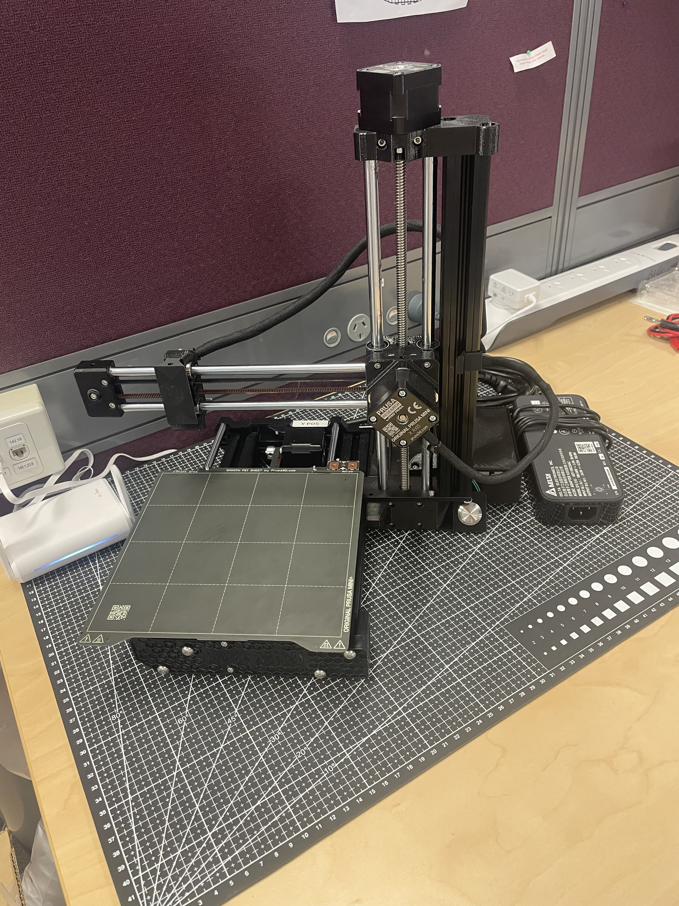
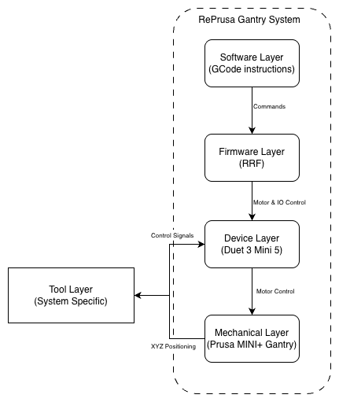

# RePrusa

RePrusa is a modular precision gantry platform developed by repurposing a Prusa MINI+ 3D printer and integrating it with a Duet 3 Mini 5+ controller running RepRapFirmware.

The project was developed during my work with the Biomedical Innovation Group (BIG) at the University of Sydney. Many experimental workflows in biomedical research rely on shared laboratory equipment, which can be difficult to access, schedule, or configure for specialised experiments.

RePrusa explores an alternative approach: using a programmable precision gantry system as a general-purpose experimental automation platform.

By combining an open motion-control architecture with modular tool integration, the system allows different experimental tools to be mounted and controlled using the same underlying platform. This enables researchers to rapidly prototype automated experimental workflows while maintaining precise motion control and repeatability.

The project demonstrates how consumer hardware and open firmware can be repurposed to create flexible experimental infrastructure for research environments.

Prototype RePrusa system installed at the Biomedical Innovation Group laboratory at the University of Sydney.

## Project Overview

RePrusa is built around a modular architecture consisting of four main layers:

1. **Mechanical Platform**  
   A modified Prusa MINI+ gantry provides precise and repeatable XYZ motion.

2. **Control Hardware**  
   A Duet 3 Mini 5+ controller replaces the original printer electronics, providing open configuration, wireless connectivity, and flexible I/O.

3. **Firmware and Motion Logic**  
   The system runs RepRapFirmware, enabling programmable motion control and integration with external hardware.

4. **Modular Tool Systems**  
   Experimental tools can be mounted to the gantry depending on the research application. Each tool defines its own control macros and workflow.

This layered design allows the motion platform to remain constant while different experimental systems can be integrated on top of it.

**Design Notes**

The current implementation uses a modified Prusa MINI+ as the motion platform due to its compact footprint, reliability, and readily available hardware. However, the architecture of RePrusa is not tied to this specific gantry system. Any motion platform could be used in its place if higher precision, larger working volumes, or different kinematic configurations are required. The control architecture and firmware configuration are designed to remain adaptable to different gantry systems.

The Duet 3 Mini 5+ WiFi controller was selected primarily for its open configuration environment and its integration with RepRapFirmware. This combination allows full control over motion parameters, programmable macro logic, and flexible hardware I/O. These capabilities make it well suited for experimental automation where external devices, sensors, or custom control routines may need to be integrated into the system.
## System Architecture

The RePrusa platform follows a layered architecture that separates motion, control, and experimental tooling. This allows the motion platform and controller to remain constant while different experimental systems can be integrated as interchangeable tools.

The system consists of five primary layers:

**Mechanical Layer**  
A Prusa MINI+ gantry provides precise and repeatable XYZ positioning and physically interacts with the mounted experimental tool.

**Control Layer**  
A Duet 3 Mini 5+ WiFi controller manages motion control, stepper drivers, and hardware I/O, acting as the central interface between the gantry and external devices.

**Firmware Layer**  
RepRapFirmware (RRF) runs on the controller and provides configurable motion control and a programmable interface for system operation.

**Software Layer**  
Experimental workflows are implemented using G-code macros and control logic, defining motion routines, tool activation, and automated experimental sequences.

**Tool Layer**  
Experimental systems are mounted as interchangeable modules. These tools act as a black-box subsystem that interacts with the platform through mechanical positioning and controller I/O communication.

This separation allows new experimental tools to be integrated without modifying the underlying motion platform.

## Platform Setup

The RePrusa platform is designed so that a Cartesian gantry system can be paired with a Duet controller and configured as a programmable experimental motion platform. While this project uses a modified Prusa MINI+ gantry, the same general setup process applies to other compatible motion systems.

### 1. Motion Platform

Begin with a functioning gantry system capable of precise XYZ positioning. This provides the mechanical foundation of the platform.

The gantry should include:

- stepper-driven axes
- endstop or probing sensors
- a stable frame and carriage for tool mounting

Although a Prusa MINI+ was used for this implementation, other gantry systems can be used depending on required working area, rigidity, or positioning precision.

### 2. Controller Integration

Replace or interface the existing motion controller with a **Duet 3 Mini 5+ WiFi** (or other compatible Duet board).

The controller manages:

- stepper motor drivers
- axis motion control
- endstop inputs
- hardware I/O for external devices

Motor wiring, endstops, and power connections should be connected according to the Duet documentation.

Duet controller documentation:  
https://docs.duet3d.com/

### 3. Firmware Configuration

Duet controllers run **RepRapFirmware (RRF)**, which defines the behaviour of the motion system through configuration files.

The main configuration file (`config.g`) defines:

- axis directions and steps per mm
- motor currents
- endstop behaviour
- travel limits
- homing procedures

A convenient way to generate an initial configuration is the RepRapFirmware configuration tool: https://configtool.reprapfirmware.org/

This tool allows the motion system, kinematics, and hardware options to be configured before generating a working `config.g` file.

### 4. Motion System Verification

After uploading the configuration to the controller, basic system checks should be performed:

- verify correct motor directions
- test homing routines
- confirm axis limits and travel ranges
- validate stepper currents and motion smoothness

Once the motion platform is operating reliably, experimental tools can be mounted and controlled through the firmware macro system.

Further details on RepRapFirmware configuration and motion tuning can be found in the official documentation:

https://docs.duet3d.com/User_manual/RepRapFirmware

## Experiment Workflow and Tool Integration

The RePrusa platform executes experiments through a macro-driven workflow built on RepRapFirmware. Experimental tools are integrated as modular subsystems while motion control and automation logic remain managed by the platform.

Each experiment is executed through a sequence of G-code macros that define device setup, motion routines, and experiment execution.

### Tool Integration

Experimental tools are mounted to the gantry as interchangeable modules. Each tool interacts with the platform through two primary interfaces:

**Mechanical interaction**  
The gantry positions the tool with precise XYZ motion relative to the experimental workspace.

**Control interface**  
The Duet controller communicates with the tool using hardware I/O, allowing external devices such as pumps, plasma generators, or sensors to be triggered or monitored during an experiment.

Each tool typically requires:

- a mounting interface on the gantry carriage
- optional controller I/O connections
- a set of control macros defining tool behaviour

This approach treats tools as modular subsystems while the motion platform and automation framework remain unchanged.

### Experiment Workflow

Experiments follow a general workflow consisting of three stages:

1. **System Preparation**  
   - home the motion platform  
   - load or select the required tool  
   - initialise external devices if required  

2. **Experiment Execution**  
   - activate the experimental tool through macros  
   - execute predefined motion paths  
   - coordinate motion with device control signals  

3. **Completion and Reset**  
   - stop tool operation  
   - return the gantry to a safe position  
   - prepare the system for the next experiment  

### Macro-Based Control

RepRapFirmware allows reusable G-code macros to define experiment behaviour. These macros encapsulate common actions such as tool activation, device control, and motion routines.

Typical macro categories include:

- **setup macros** – prepare the system or initialise devices  
- **tool macros** – control specific experimental hardware  
- **motion macros** – execute experimental motion paths  
- **shutdown macros** – safely stop the experiment

By organising experiments into reusable macros, new workflows can be developed without modifying the underlying platform configuration.

<!-- 
RePrusa

repurposing a prusa gantry for reliable biomedical research and experimentation. This git repository encapsulates my project that I had completed under employment at the university of Sydney's Biomedical Innovation Group (BIG). My project problem outlined the struggle for postdoctoral  and pHD students to carry out experiemntations to gather data and publish results, currently most of the work is outsourced to university facilities taht can be crowded and be difficult to book around your own work schedule and reliably use the machinary without others messing with the settings, code and etc. This project helps to create reliable, xxxxxx, for research groups to experiment quickly and also xxxxxxxx.

picture of protoyped RePrusa at BIG headquarters at USYD.

xxxxxxxxxxxx

Table of Content:
- System description
- Getting started/Installation
- Usage 
- Future works

System description

there is two levels of systems, there is the gnatry that conducts the movement of the system and is controlled purely from the duet 3 control board (discussed later), and ontop of that is a specific system that is individually develop for a purpose that is specfic for the research interest. The later system architecture is specfiic to the intended purpose and will not be discussed here, but an example will be given on how to designa nd integrate it to the 3d gantry system,

the modular 3d gantry system archicture exists as following:

the phyiscal architecture simply consists of a 3d gantry, in my project i developed this off a Prusa MINI+. Thsi was chosen as it is a compact, versatile and easily rewired to fit the exact purpsoe. it also has micrometer precision (albeit with lots of tuning and configuration). although i habe useda a prusa MINI+ and 3d printer or gantry system can be used.

at the hardware level i use a duet 3 mini 5+ wifi board as it allows wireless conenction, full motor control, ..... . although the prusa mini+ already ahs a control board it is not completely open source in how to use it and control it. furthermore the configuration can be changed to any 3d printer gantry as the duet 3 configurations is adaptable, more information on precise configurations for any gantry system can be found on the duet webstie (link here to configure printer to duet 3)

at he software level the duet 3 board naturally runs RepRapFirmware (RRF), this is a large reason why. ichose the duet 3 board as it allows for complete control of the system and has logic integrate into the gcode. also supports IO communication with controllers for closed loop feedback sysstems and potential for reactive code based on environemtn or added sensors, information, etc. furthermore has the ability for interupt and interupt handlers for asynchronous external signals to control specific features whilst operating.

An example of a system that was adapted to this was a pen, this did not require any IO communication from the duet baord, but required a tool profile to be described on the duet system then the gcode simply ran the track that which would "draw " the desired image. This is a simple exmaple and can be furthered to the extent of close loop feedback such as plasma jetting, having a controller control the voltage, flow rate and etc can be used, and based on the communication IO the code can react to the feedback from teh controller assuimng that systems has been properly configured.

Getting started, (maybe change the title to describe how i am setting up everything specifically for me)

first most when getting started you must first have built the platform and rewired everything to a duet controller. the next stage is to follow teh online guides to configure the setting, motor qualities, etc. 

the steps to this can be found here:
- links to specific webpages + how it relates to the development of this project
- ie configuring a duet board

a brief outline of how the duet 3 boards operate. upon boiot it does all the things in config.g, explain that the gcode and mcode for the duet board is is specfic and adaptable to a lot fo things. in this project i like to create macros that can be called upon for situations

this is the readme for the entire project of my work here at BIG. In the wikki i will explain how more specfiic things are done for the pproject. ie the process to create a specific system onto the framw that exists. or more detailed insight into the controller or 3d gantry.

Within the git reposityory you will find
- controller code scaffold
- controller code example that is used to control a NE-Pump 1000 for fluidic application
- gcodes and macros for the duet
- STL files 

The future of this project is to have a fully integratable system that can help researchers and/or educators to more quickly go from theory to practice, to achieve results through experiments quickly and reliably with a easily controlled system. Although currently it requires a someone who understands the system to set it up, i hope to streamline this such that it is a simple process that anyone may use.

-->